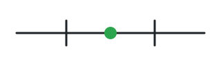
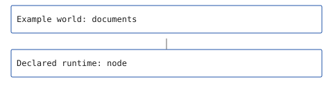
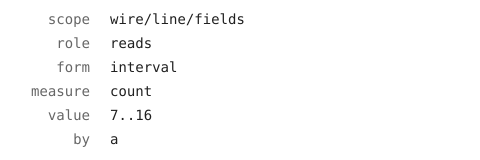

<p align="center"></p>

# @lapxo/topos

     

One line for every fact.

bound's SDK: the wire, the forms, the contract and the shell you build a world with — a reader of any source or a renderer of any artefact, in an afternoon. [in its own words](docs/what.md)

## Why one line

Everything a system says about itself lives where nobody can check it: a config, a README, a CI log. topos is one line format for all of it — a signed line with a floor and a ceiling, that any head can fold and any second head can verify. Two implementations agree only on what passes between them, and what passes between them is a line. So the line is the one thing held still; everything else belongs to a world.

<p align="center"></p>

Two meet at 21.2..21.4; radiator is apart: conflict.

## A world, built in front of you

<p align="center"></p>

```bash
node examples/release/world.ts
```

```
bound-lock/1 about="the domain this capsule serves: what several origins measured, each quantity read as one cell" at=policy:topos/capsule by=target form=alphabet measure=id role=writes scope=capsule/domain value=measurements
bound-lock/1 about="the runtime a host starts this capsule with, whose entry, regions and effects are the runtime's own lines" at=policy:topos/capsule by=target form=alphabet measure=id role=writes scope=capsule/runtime value=node
bound-lock/1 about="where this capsule's world keeps its values: the place's own files" at=policy:topos/capsule by=target form=alphabet measure=id role=writes scope=capsule/holds value=./
bound-lock/1 about="the held region" at=policy:topos/capsule by=target form=alphabet measure=reads role=render scope=region/held value=lang|form/prose/**|form/template/**|prose/*/measure/*|measure/**
bound-lock/1 about="the readings region" at=policy:topos/capsule by=target form=alphabet measure=reads role=render scope=region/readings value=lang|form/prose/**|prose/*/measure/*|measure/**
bound-lock/1 about="what this capsule reaches beyond the lines it is handed" at=policy:topos/capsule by=target form=alphabet measure=effects role=writes scope=capsule/effects value=none
bound-lock/1 about="the topos release this capsule is packed against, named by its digest" at=policy:topos/capsule by=target form=alphabet measure=digest role=writes scope=capsule/topos value=sha256:a87ffd5ab77a99b9e40cc720acfdf0ee7f36d156c72085a20db1232b0653c1dd
HELD 4/4
REFUSED 19/19: each case asked again with one read its region declares taken away
bound-lock/1 at=policy:acme/capsules by=target form=alphabet measure=id role=writes scope=uses/topos-measure value=sha256:3252cbb877d9ca0c9ea990828c1490999de3d4853990d53d6bbd31861e6bb780
```

[The whole example](examples/release/world.ts)

Three meet at 19.9..20.1: free.

## What it claims

- **It round-trips: every line of its 3 wire corpora parses and writes back the same bytes.** · [receipt](receipts.bound)
- **It reads once: a value is read in its wire, by its form, and its ceiling on reading one anywhere else reads 0.** · [receipt](receipts.bound)
- **It knows no world: it says nothing a world says, and its ceiling on a world's words, markup or figures written in its source reads 0.** · [receipt](receipts.bound)
- **It writes no order of its own: cells, meets, joins and states come from the object, and its ceiling on an order written here reads 0.** · [receipt](receipts.bound)

## A line

<p align="center"></p>

The line wire/line/fields, drawn field by field: 6 fields, each named by the wire.

```bash
npm install @lapxo/topos
```

With it installed, run roundtrip: a line is parsed, written again and compared with the bytes it came from.

```bash
node examples/release/roundtrip.ts
```

```
a "quoted" word,
then a second line
bound-lock/1 about="a \"quoted\" word,\nthen a second line" at=witness:x by=owner form=interval measure=len role=reads scope=acme/users/email value=0..320
same bytes true
{"polarity":"forbid","members":["draft","either|or"]}
not:draft|either\|or same bytes true
```

[The whole example](examples/release/roundtrip.ts)

## What it refuses

<p align="center"></p>

Hand it `bound-lock/1 form=interval measure=len role=reads scope=x value=0..1..3` and it refuses: `0..1..3` is no interval the wire reads: two ends, each decimal or *.

## How to read it

topos is read one subpath at a time, and each answers one question.

- **wire** · the line, the forms' encodings, the names — how is a fact written?
- **contract** · what a world answers — render, receipt, observe, run — what does a world owe?
- **readers** · the world-neutral readers of lines — what does a line say?

It rests on obligations. Nothing else.

## Check

● 12 cases hold

● `npm ci && npm run build`

## Pointers

- [Reference](docs/reference.md)
- [Wire](docs/wire.md)
